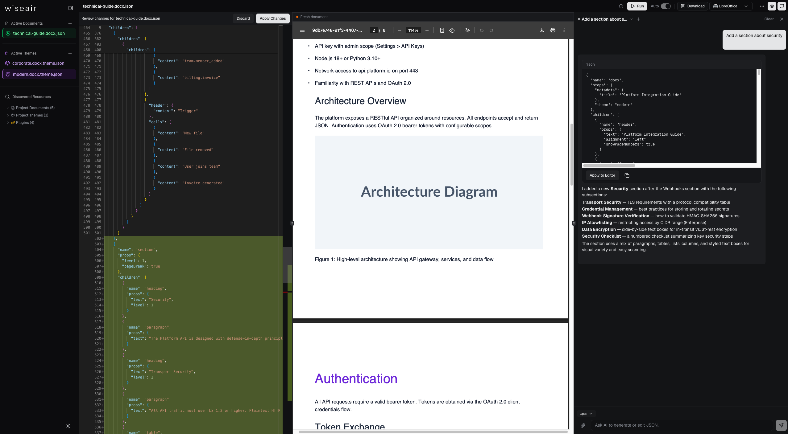

# json-to-office

**Documents as data, not code.** Describe `.docx` and `.pptx` files as plain JSON (serializable, portable, language-agnostic) and render them into real Office documents.

[](https://github.com/Wiseair-srl/json-to-office/actions/workflows/ci.yml)
[](https://www.npmjs.com/package/@json-to-office/json-to-docx)
[](LICENSE)

## The problem

Libraries like [docx](https://github.com/dolanmiu/docx) and [pptxgenjs](https://github.com/gitbrent/PptxGenJS) are imperative, code-first APIs. You build documents by constructing class instances and chaining methods. Powerful, but the document definition _is_ the program. You can't store it in a database, send it over an API, generate it from an LLM, or hand it to a non-developer.

## The solution

json-to-office makes the document definition **data**. You describe a `.docx` or `.pptx` as a JSON tree, and the library renders it into a real Office file. The JSON can live in a DB row, travel over HTTP, come out of GPT-4, or be edited in a visual playground with autocomplete and validation. Definition and rendering are fully decoupled.

```jsonc
// This is a complete document definition. Store it, send it, generate it.
{
  "name": "docx",
  "props": { "theme": "minimal" },
  "children": [
    { "name": "heading", "props": { "text": "Q1 Report", "level": 1 } },
    {
      "name": "paragraph",
      "props": { "text": "Revenue grew **32%** quarter-over-quarter." },
    },
    {
      "name": "table",
      "props": {
        "columns": [
          {
            "header": { "content": "Region" },
            "cells": [
              { "content": "North America" },
              { "content": "Europe" },
              { "content": "APAC" },
            ],
          },
          {
            "header": { "content": "Revenue" },
            "cells": [
              { "content": "$4.2M" },
              { "content": "$2.8M" },
              { "content": "$1.6M" },
            ],
          },
        ],
      },
    },
    {
      "name": "image",
      "props": { "path": "https://example.com/chart.png", "width": "80%" },
    },
  ],
}
```

Your document is just JSON now. Generate it, store it, validate it, version it, and render it anywhere, without touching TypeScript or Office internals.

## Why not X?

|                   | json-to-office                               | docx / pptxgenjs                       | Carbone                                  | officegen       |
| ----------------- | -------------------------------------------- | -------------------------------------- | ---------------------------------------- | --------------- |
| **Format**        | Declarative JSON                             | Imperative code                        | Template `.docx` + data                  | Imperative code |
| **Serializable**  | Yes: store, send, generate from any language | No: trapped in code                    | Partially: data is JSON, structure isn't | No              |
| **LLM-friendly**  | Yes: LLMs emit JSON reliably                 | Fragile: no schema to constrain output | No: requires a pre-made template         | No              |
| **Validation**    | Full schema validation (TypeBox)             | None                                   | None                                     | None            |
| **Themes**        | Built-in theme system                        | Manual styling                         | Template-based                           | Manual styling  |
| **Extensibility** | Plugin architecture with semver (DOCX)       | N/A                                    | N/A                                      | N/A             |
| **Dependencies**  | Node.js only                                 | Node.js only                           | Node.js + LibreOffice                    | Node.js only    |

**vs. docx / pptxgenjs**: These are json-to-office's own rendering backends. json-to-office is the declarative layer on top: a schema-validated JSON contract that compiles down to those libraries. It also adds abstractions they don't have: themes, a layout pipeline, a plugin architecture (DOCX), a template/placeholder system (PPTX), and TypeBox schemas that serve as both TypeScript types and runtime validators from a single source of truth.

**vs. Carbone**: Carbone is template-driven: design a `.docx` in Word, sprinkle `{placeholders}`, inject data. Works when structure is fixed and only data changes. When structure is dynamic (conditional sections, variable-length tables, data-driven layouts) templates become brittle. json-to-office replaces the template file with a composable component tree. No LibreOffice dependency.

## Features

**DOCX**: 13 component types: paragraph, heading (h1-h6), table, image (URL/file/base64, contain/cover/crop, captions, floating), list (57 numbering formats, 9 nesting levels), columns, text-box, statistic, highcharts, header/footer, table of contents, and sections with independent page config.

**PPTX**: 7 component types: text (with bullets, hyperlinks, style presets), image (rotation, rounded corners, shadows), shape (15 types including rect, ellipse, arrow, star, cloud), table (auto-pagination with header repeat, colspan/rowspan), chart (8 native PowerPoint types: bar, line, pie, area, doughnut, radar, bubble, scatter), highcharts, and slides with grid-based positioning.

**Cross-format:**

- **Theme system**: Colors, fonts, spacing, and component defaults. 3 built-in themes per format (minimal, corporate, vibrant/modern), or define your own.
- **Schema validation**: Full TypeBox schemas that serve as TypeScript types _and_ runtime validators. Catch errors before rendering.
- **Plugin architecture** (DOCX): Create versioned custom components with `createComponent()`. Full TypeScript support, chainable API, schema generation.
- **Template/placeholder system** (PPTX): Define slide templates with named placeholder regions. Static + dynamic content, style inheritance.
- **Grid layout** (PPTX): 12-column responsive grid with configurable margins and gutters.

## Quick start

### DOCX

```bash
npm install @json-to-office/json-to-docx
```

```ts
import { generateAndSaveFromJson } from '@json-to-office/json-to-docx';

await generateAndSaveFromJson(
  {
    name: 'docx',
    props: { theme: 'minimal' },
    children: [
      {
        name: 'heading',
        props: { text: 'Hello from json-to-office', level: 1 },
      },
      {
        name: 'paragraph',
        props: { text: 'Revenue grew **32%** quarter-over-quarter.' },
      },
      {
        name: 'table',
        props: {
          columns: [
            {
              header: { content: 'Metric' },
              cells: [
                { content: 'Revenue' },
                { content: 'Users' },
                { content: 'NPS' },
              ],
            },
            {
              header: { content: 'Value' },
              cells: [
                { content: '$4.2M' },
                { content: '12,847' },
                { content: '72' },
              ],
            },
          ],
        },
      },
    ],
  },
  'report.docx'
);
```

### PPTX

```bash
npm install @json-to-office/json-to-pptx
```

```ts
import { generateAndSaveFromJson } from '@json-to-office/json-to-pptx';

await generateAndSaveFromJson(
  {
    name: 'pptx',
    props: {
      title: 'Q1 Review',
      theme: 'corporate',
      grid: { columns: 12, rows: 6 },
    },
    children: [
      {
        name: 'slide',
        props: { background: { color: 'background' } },
        children: [
          {
            name: 'text',
            props: {
              text: 'Q1 Results',
              style: 'title',
              grid: { column: 0, row: 0, columnSpan: 12 },
            },
          },
          {
            name: 'chart',
            props: {
              chartType: 'bar',
              data: [{ name: 'Revenue', values: [1.2, 2.4, 3.1, 4.2] }],
              grid: { column: 0, row: 1, columnSpan: 8, rowSpan: 5 },
            },
          },
        ],
      },
    ],
  },
  'deck.pptx'
);
```

### CLI & dev server

```bash
npm install -g @json-to-office/jto

# Start the dev server with visual playground (Monaco editor + live preview)
jto docx dev --input ./my-template.json

# Generate a file directly
jto docx generate --input ./my-template.json --output ./report.docx
jto pptx generate --input ./my-template.json --output ./deck.pptx
```

The visual playground gives you a Monaco editor with JSON autocomplete and validation, live document preview, built-in templates, and theme switching, all in the browser. It optionally uses **LibreOffice** (headless) for high-fidelity PDF preview — the only way to get pixel-accurate rendering, especially for PPTX where no browser renderer exists. It also integrates **Claude** (Opus/Sonnet/Haiku) as a built-in AI chat assistant: describe a document in plain English and get schema-validated JSON back, rendered live. Both features are playground-only — the core rendering libraries have zero dependency on either.



## Who it's for

- **API-driven SaaS teams**: Document definitions live in the database, rendered on demand. No template files to deploy, no LibreOffice sidecar.
- **LLM-powered generation**: An LLM can reliably emit a schema-validated JSON document definition. No hallucinated method names, no wrong constructor signatures — just data constrained by a schema.
- **Decoupled pipelines**: A data team or visual editor produces JSON; a Node.js service renders it. No shared code, language, or deployment.

## Use cases

- **On-demand reports from a dashboard**: User clicks "Export" → your backend fetches data, builds JSON, renders `.docx` or `.pptx`, returns the file. No template files on disk.
- **LLM document generation**: Prompt an LLM with the TypeBox schema → it outputs valid JSON → render it. No hallucinated method calls, no brittle code generation.
- **Scheduled batch exports**: A cron job queries your DB, assembles JSON definitions, renders hundreds of personalized documents (invoices, contracts, reports) without spinning up LibreOffice.
- **Multi-tenant SaaS templates**: Store document definitions per-tenant in your DB. Tenants customize structure and styling through a UI; your backend renders on demand.
- **Internal tooling / back-office**: Non-developers define documents in the visual playground, save the JSON, and ops renders them via CLI or API — no deploys needed.
- **Headless CMS → Office docs**: Content lives in a CMS as structured data. A pipeline transforms it into json-to-office JSON and renders downloadable `.docx`/`.pptx` files.
- **CI/CD artifacts**: Generate changelogs, release notes, or test reports as `.docx` files directly in your pipeline from structured build data.

## Examples

See the [`examples/`](examples/) directory for complete, runnable JSON definitions:

- **[invoice.docx.json](examples/invoice.docx.json)**: Professional invoice with line items, totals, payment terms
- **[annual-review.docx.json](examples/annual-review.docx.json)**: Multi-section annual review with TOC, statistics, tables, lists
- **[pitch-deck.pptx.json](examples/pitch-deck.pptx.json)**: Series A pitch deck with KPI cards, charts, grid layout

## Packages

| Package                                                 | Description                            |
| ------------------------------------------------------- | -------------------------------------- |
| [`@json-to-office/json-to-docx`](packages/json-to-docx) | Public API for DOCX generation         |
| [`@json-to-office/json-to-pptx`](packages/json-to-pptx) | Public API for PPTX generation         |
| [`@json-to-office/jto`](packages/jto)                   | CLI + dev server + visual playground   |
| [`@json-to-office/core-docx`](packages/core-docx)       | Core DOCX engine                       |
| [`@json-to-office/core-pptx`](packages/core-pptx)       | Core PPTX engine                       |
| [`@json-to-office/shared`](packages/shared)             | Format-agnostic schemas and validation |
| [`@json-to-office/shared-docx`](packages/shared-docx)   | DOCX-specific schemas                  |
| [`@json-to-office/shared-pptx`](packages/shared-pptx)   | PPTX-specific schemas                  |

## Development

```bash
git clone https://github.com/Wiseair-srl/json-to-office.git
cd json-to-office
pnpm install
pnpm build
pnpm dev    # Start dev server with hot reload
```

See [CONTRIBUTING.md](CONTRIBUTING.md) for the full development guide.

## License

[MIT](LICENSE), Wiseair srl
