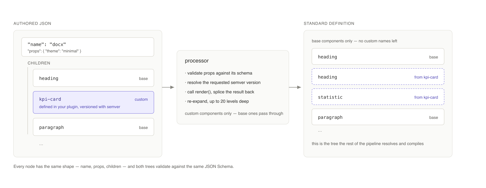

# json-to-office

**Documents as data, not code.** Describe `.docx` and `.pptx` files as plain JSON (serializable, portable, language-agnostic) and render them into real Office documents.

[](https://github.com/Wiseair-srl/json-to-office/actions/workflows/ci.yml)
[](https://www.npmjs.com/package/@json-to-office/json-to-docx)
[](https://www.npmjs.com/package/@json-to-office/json-to-pptx)
[](LICENSE)

> **Try the live playgrounds:** [DOCX Playground](https://docx.json-to-office.com) | [PPTX Playground](https://pptx.json-to-office.com)

## Table of contents

- [Quick start](#quick-start)
- [The problem](#the-problem)
- [The idea](#the-idea)
- [What this buys you](#what-this-buys-you)
- [Architecture](#architecture)
- [Features](#features)
- [Full examples](#full-examples)
- [Who it's for](#who-its-for)
- [Use cases](#use-cases)
- [Examples](#examples)
- [Packages](#packages)
- [Development](#development)

## Quick start

```bash
pnpm add @json-to-office/json-to-docx @json-to-office/json-to-pptx
```

```ts
import { generateAndSaveFromJson as docx } from '@json-to-office/json-to-docx';
import { generateAndSaveFromJson as pptx } from '@json-to-office/json-to-pptx';

// DOCX
await docx(
  {
    name: 'docx',
    props: { theme: 'minimal' },
    children: [
      { name: 'heading', props: { text: 'Q1 Report', level: 1 } },
      {
        name: 'paragraph',
        props: { text: 'Revenue grew **32%** quarter-over-quarter.' },
      },
    ],
  },
  'report.docx'
);

// PPTX
await pptx(
  {
    name: 'pptx',
    props: { theme: 'minimal', grid: { columns: 12, rows: 6 } },
    children: [
      {
        name: 'slide',
        props: { background: { color: 'background' } },
        children: [
          {
            name: 'text',
            props: {
              text: 'Q1 Results',
              style: 'title',
              grid: { column: 0, row: 0, columnSpan: 12 },
            },
          },
          {
            name: 'chart',
            props: {
              type: 'bar',
              data: [
                {
                  name: 'Revenue',
                  labels: ['Q1', 'Q2', 'Q3', 'Q4'],
                  values: [1.2, 2.4, 3.1, 4.2],
                },
              ],
              grid: { column: 0, row: 1, columnSpan: 8, rowSpan: 5 },
            },
          },
        ],
      },
    ],
  },
  'deck.pptx'
);
```

Or explore interactively with the visual playground (Monaco editor, live preview, AI assistant):

**Try it online:** [DOCX Playground](https://docx.json-to-office.com) | [PPTX Playground](https://pptx.json-to-office.com)

```bash
pnpm add --global @json-to-office/jto
jto docx dev
jto pptx dev
```


For CI / scripted pipelines that don't need the playground, install the lean [`@json-to-office/jto-cli`](packages/jto-cli) instead — same `generate`/`validate`/`schemas`/`discover`/`init`/`fonts` commands, ~16 deps vs ~70.

```bash
pnpm add --global @json-to-office/jto-cli
jto-cli docx generate doc.json
```

For coding agents, [`@json-to-office/mcp-server`](packages/mcp-server) exposes the same loop — discover, author, validate, preview rendered pages, generate — over the Model Context Protocol. Point any MCP client at it; nothing to install first.

```bash
claude mcp add json-to-office -- npx -y @json-to-office/mcp-server
```

## The problem

A backend that has to emit a `.docx` or a `.pptx` has four options, and each answers a different question than the one you asked.

**Build it in code.** [docx](https://github.com/dolanmiu/docx) and [pptxgenjs](https://github.com/gitbrent/PptxGenJS) give you class instances and method chains, and they work. But the document definition _is_ the program. A customer complains about the report you sent in March; you can't retrieve what it said, because it never existed as a thing — only as a code path that ran once. Two versions of a layout diff as a diff of TypeScript.

**Fill in a template.** Templates work exactly as long as the structure is fixed and only the values move. The first conditional section breaks that, and so does the first table whose row count depends on the data. And a `.docx` template is an opaque binary: you cannot diff it, lint it, review it, or compose two of them.

**Hand it to a SaaS.** Built for one human assembling one deck in a browser. No API contract, no self-hosting, no ownership of the artifact.

**Ask a model for the file.** An LLM will happily emit a `.pptx`. Ask twice and you get two different documents, neither validated, neither replayable — and the prompt is not the document, so there is nothing to store, diff, or regenerate.

The four disagree about something more basic: **what a document is, in a system.** If it's an artifact you render once and email, any of them is fine. If it's an output of your platform — emitted thousands of times, on demand, by services and models, branded, regeneratable, auditable — then it has to behave like everything else you already know how to operate: a value you can store, validate, version, and diff.

## The idea

> **The document is a value. Rendering is a function.**

json-to-office splits the two apart. The definition is a JSON tree of components and props, and it is inert data: no code, no raw OOXML, no escape hatch. Rendering is a pinned pipeline that turns that data into Office bytes, behind a swappable backend. The only thing the two halves agree on is a schema.

```jsonc
// This is a complete document definition. Store it, send it, generate it.
{
  "name": "docx",
  "props": { "theme": "minimal" },
  "children": [
    { "name": "heading", "props": { "text": "Q1 Report", "level": 1 } },
    {
      "name": "paragraph",
      "props": { "text": "Revenue grew **32%** quarter-over-quarter." },
    },
    {
      "name": "table",
      "props": {
        "columns": [
          {
            "header": { "content": "Region" },
            "cells": [
              { "content": "North America" },
              { "content": "Europe" },
              { "content": "APAC" },
            ],
          },
          {
            "header": { "content": "Revenue" },
            "cells": [
              { "content": "$4.2M" },
              { "content": "$2.8M" },
              { "content": "$1.6M" },
            ],
          },
        ],
      },
    },
    {
      "name": "image",
      "props": { "path": "https://example.com/chart.png", "width": "80%" },
    },
  ],
}
```

Store it, send it, generate it, review it. Rendering happens later, somewhere else, maybe by someone else.

One judgement call follows from the split, and it is worth getting right:

> **Structure in the tree. Style in the theme.**

The tree carries what the document _means_ — this is a heading, this is a table with these columns. The theme carries what it _looks like_ — colors, fonts, spacing, per-component defaults — and changes for every document at once. Pushing style into props never looks like a mistake at the time; it becomes one when a second tenant arrives and the branding is scattered across ten thousand rows of JSON.

## What this buys you

**The same inputs produce the same bytes.** Volatile OOXML metadata and ZIP timestamps are normalized, so a definition, a theme, a pinned library version, and unchanged asset bytes render byte-identically. Regenerating last quarter's report is a real operation, not an approximation of one.

**An LLM emits a value, not a program.** The model's job shrinks to producing a small object against a JSON Schema — no method names to hallucinate, no constructor signatures to get wrong, and a validator that rejects the attempt before anything renders. The unreliable part produces content; deterministic code does the rendering.

**Documents review like code.** The JSON is what lands in the pull request, so a change to a contract template is a diff a human can read. DOCX goes further: two versions diff into a redline that opens in Word as native tracked changes.

**One structure, many brands.** The same tree under a different theme is a different-looking document. Multi-tenant branding is a column in a table, not a fork of your rendering code.

**Nothing to install next to it.** Rendering is pure Node — no Word, no LibreOffice, no headless browser, no per-tenant template files on disk.

## Architecture

A JSON document is a tree of **components**. Every node has the same shape, and comes in two flavours: **base components** (heading, paragraph, table, etc.) and **custom components** that you define in your project via a plugin system.



The **processor** walks the tree. When it encounters a custom component, it validates the props against the schema, resolves the requested semver version, calls `render()`, and splices the result back into the tree. If `render()` returns other custom components, the processor re-expands them recursively (up to 20 levels deep). The output is a flat tree of base components only. That tree is then **compiled** to a renderer-neutral intermediate representation (`DocxIR` / `PptxIR`) — theme colours resolved, fonts substituted, units explicit, authoring-only components expanded — and a **renderer adapter** turns the IR into bytes. docx.js and pptxgenjs are the defaults; an experimental `office-open` backend is installed alongside them and selected per document or per invocation. Each adapter declares what it supports, so an unsupported feature fails before any bytes exist rather than going missing in the file.

The same prepared tree feeds the first-class **quality layer**. `@json-to-office/quality` applies design profiles and run policies to format facts, producing path-addressed diagnostics with certainty and evidence. Quality advises by default and can gate CI or generation explicitly. See [Design quality](docs/guide/design-quality.md).


### Custom components (plugin system)

Define custom components with `createComponent` + `createVersion`. Each version has a [TypeBox](https://github.com/sinclairzx81/typebox) schema for props (chosen over Zod for first-class JSON Schema support) and an async `render()` function that returns an array of standard components (or other custom components, which are expanded recursively):

```ts
import {
  createComponent,
  createVersion,
} from '@json-to-office/json-to-docx/plugin';
import { Type } from '@sinclair/typebox';

const kpiCard = createComponent({
  name: 'kpi-card',
  versions: {
    '1.0.0': createVersion({
      propsSchema: Type.Object({
        label: Type.String(),
        value: Type.Number(),
        unit: Type.Optional(Type.String()),
      }),
      render: async ({ props }) => [
        { name: 'heading', props: { text: props.label, level: 3 } },
        {
          name: 'statistic',
          props: {
            value: `${props.value}${props.unit ? ` ${props.unit}` : ''}`,
          },
        },
      ],
    }),
  },
});
```

Then register it in the generator and use it in JSON like any built-in component:

```ts
const generator = createDocumentGenerator().addComponent(kpiCard).build();

await generator.generateToFile(
  {
    name: 'docx',
    children: [
      { name: 'kpi-card', props: { label: 'Revenue', value: 4.2, unit: 'M$' } },
    ],
  },
  'report.docx'
);
```

**Versioning.** Each component supports multiple semver-keyed versions with different props and rendering logic. The document specifies which version to use; if omitted, the latest is resolved automatically. This enables non-breaking evolution of enterprise templates across clients.

**Schema generation.** The enriched schema (standard + custom components) is exportable as JSON Schema, so you get validation and IDE autocomplete even for your custom components.

Generated JSON Schemas are local artifacts rather than stable hosted URLs today. Pin the CLI version and commit the generated files in the consuming application when the schema is an API contract; see the [schema versioning guide](docs/reference/json-schemas.md#versioning-schemas).

## Features

### DOCX: 13 components

| Component          | Highlights                                                      |
| ------------------ | --------------------------------------------------------------- |
| paragraph, heading | Markdown-style bold/italic in text, h1–h6                       |
| table              | Auto-width columns, merged cells, styled headers                |
| image              | URL / file / base64, contain / cover / crop, captions, floating |
| list               | 57 numbering formats, 9 nesting levels                          |
| columns            | Multi-column layouts                                            |
| text-box           | Positioned text regions                                         |
| statistic          | KPI cards                                                       |
| highcharts         | Server-side chart rendering                                     |
| header / footer    | Per-section, first-page variant                                 |
| table of contents  | Auto-generated from headings                                    |
| section            | Independent page size, orientation, margins                     |

### PPTX: 7 components

| Component  | Highlights                                                                        |
| ---------- | --------------------------------------------------------------------------------- |
| text       | Bullets, hyperlinks, style presets                                                |
| image      | Rotation, rounded corners, shadows                                                |
| shape      | 15 types: rect, ellipse, arrow, star, cloud, etc.                                 |
| table      | Auto-pagination with header repeat, colspan/rowspan                               |
| chart      | 8 native PowerPoint types: bar, line, pie, area, doughnut, radar, bubble, scatter |
| highcharts | Server-side chart rendering                                                       |
| slide      | Grid-based positioning, backgrounds, document-local JSON blocks                   |

### Document diff (DOCX)

Because documents are data, two versions diff like data — and the result opens in Word as native tracked changes:

```bash
jto docx diff contract-v1.json contract-v2.json -o redline.docx
```

Every text edit becomes a real Word revision (accept/reject, author, timestamp) and the file opens in review mode. Word-level diff on paragraphs, headings, and list items; structural changes (tables, images, charts) are replaced and reported in the CLI summary. Programmatic API: `diffDocuments(oldDoc, newDoc)` from `@json-to-office/json-to-docx`; HTTP API: `POST /api/docx/diff`. In the visual playground (`jto docx dev`), use the **Compare** button in the sidebar to diff two documents and open the redline with live preview. Try it with [examples/contract-v1.docx.json](examples/contract-v1.docx.json) and [contract-v2.docx.json](examples/contract-v2.docx.json).

### Cross-format

- **Theme system**: colors, fonts, spacing, component defaults. 4 built-in DOCX themes (minimal, devportal, vermilion, consulting) and 3 PPTX themes (default, dark, minimal), or define your own.
- **Font system**: curated Office-safe font list plus code-side `fonts.extraEntries` option for embedding Google Fonts and custom TTF/OTF across DOCX and PPTX. Themes name fonts; code registers them. See [docs/fonts.md](docs/fonts.md).
- **Schema validation**: full TypeBox schemas that serve as TypeScript types _and_ runtime validators. Catch errors before rendering.
- **Plugin architecture**: create versioned custom components with `createComponent()`. Full TypeScript support, chainable API, schema generation.
- **JSON blocks** (both formats): reusable compositions defined in the document with typed slots, theme bindings and bounded layout; PPTX groups add frames and row/column distribution.
- **Grid layout** (PPTX): 12-column responsive grid with configurable margins and gutters.

## Full examples

### DOCX

```bash
pnpm add @json-to-office/json-to-docx
```

```ts
import { generateAndSaveFromJson as docx } from '@json-to-office/json-to-docx';

await docx(
  {
    name: 'docx',
    props: { theme: 'minimal' },
    children: [
      { name: 'heading', props: { text: 'Q1 Report', level: 1 } },
      {
        name: 'paragraph',
        props: { text: 'Revenue grew **32%** quarter-over-quarter.' },
      },
      {
        name: 'table',
        props: {
          columns: [
            {
              header: { content: 'Metric' },
              cells: [{ content: 'Revenue' }, { content: 'Users' }],
            },
            {
              header: { content: 'Value' },
              cells: [{ content: '$4.2M' }, { content: '12,847' }],
            },
          ],
        },
      },
    ],
  },
  'report.docx'
);
```

### PPTX

```bash
pnpm add @json-to-office/json-to-pptx
```

```ts
import { generateAndSaveFromJson as pptx } from '@json-to-office/json-to-pptx';

await pptx(
  {
    name: 'pptx',
    props: {
      title: 'Q1 Review',
      theme: 'minimal',
      grid: { columns: 12, rows: 6 },
    },
    children: [
      {
        name: 'slide',
        props: { background: { color: 'background' } },
        children: [
          {
            name: 'text',
            props: {
              text: 'Q1 Results',
              style: 'title',
              grid: { column: 0, row: 0, columnSpan: 12 },
            },
          },
          {
            name: 'chart',
            props: {
              type: 'bar',
              data: [
                {
                  name: 'Revenue',
                  labels: ['Q1', 'Q2', 'Q3', 'Q4'],
                  values: [1.2, 2.4, 3.1, 4.2],
                },
              ],
              grid: { column: 0, row: 1, columnSpan: 8, rowSpan: 5 },
            },
          },
        ],
      },
    ],
  },
  'deck.pptx'
);
```

### CLI

```bash
# Start the visual playground with live preview
jto docx dev
jto pptx dev

# Generate files directly
jto docx generate ./my-template.json -o ./report.docx
jto pptx generate ./my-template.json -o ./deck.pptx
```

### Visual playground

The dev server gives you a Monaco editor with JSON autocomplete and validation, live document preview, built-in templates, and theme switching, all in the browser. **LibreOffice is not required**: the playground renders previews natively. If LibreOffice (headless) is installed, the playground can optionally use it for high-fidelity PDF rendering, the only way to get pixel-accurate output, especially for PPTX where no browser renderer exists. It also integrates **Claude** (Opus/Sonnet/Haiku) as a built-in AI chat assistant: describe a document in plain English and get schema-validated JSON back, rendered live. Both LibreOffice and Claude are playground-only extras; the core rendering libraries have zero dependency on either.

## Who it's for

- **API-driven SaaS teams**: Document definitions live in the database, rendered on demand. No template files to deploy, no LibreOffice sidecar.
- **LLM-powered generation**: An LLM can reliably emit a schema-validated JSON document definition. No hallucinated method names, no wrong constructor signatures — just data constrained by a schema.
- **Decoupled pipelines**: A data team or visual editor produces JSON; a Node.js service renders it. No shared code, language, or deployment.

## Use cases

- **On-demand reports from a dashboard**: User clicks "Export" → your backend fetches data, builds JSON, renders `.docx` or `.pptx`, returns the file. No template files on disk.
- **LLM document generation**: Prompt an LLM with the TypeBox schema → it outputs valid JSON → render it. No hallucinated method calls, no brittle code generation.
- **Scheduled batch exports**: A cron job queries your DB, assembles JSON definitions, renders hundreds of personalized documents (invoices, contracts, reports) without spinning up LibreOffice.
- **Multi-tenant SaaS templates**: Store document definitions per-tenant in your DB. Tenants customize structure and styling through a UI; your backend renders on demand.
- **Internal tooling / back-office**: Non-developers define documents in the visual playground, save the JSON, and ops renders them via CLI or API — no deploys needed.
- **Headless CMS → Office docs**: Content lives in a CMS as structured data. A pipeline transforms it into json-to-office JSON and renders downloadable `.docx`/`.pptx` files.
- **CI/CD artifacts**: Generate changelogs, release notes, or test reports as `.docx` files directly in your pipeline from structured build data.

## Examples

See the `[examples/](examples/)` directory for complete, runnable JSON definitions:

- **[invoice.docx.json](examples/invoice.docx.json)**: Branded invoice with line items, payment instructions, and retainer terms

## Packages

| Package                                                 | Description                           |
| ------------------------------------------------------- | ------------------------------------- |
| `[@json-to-office/json-to-docx](packages/json-to-docx)` | DOCX generation from JSON             |
| `[@json-to-office/json-to-pptx](packages/json-to-pptx)` | PPTX generation from JSON             |
| `[@json-to-office/jto](packages/jto)`                   | CLI + dev server + visual playground  |
| `[@json-to-office/jto-cli](packages/jto-cli)`           | Lean CLI (no playground deps)         |
| `[@json-to-office/mcp-server](packages/mcp-server)`     | MCP server for agents (stdio)         |
| `[@json-to-office/quality](packages/quality)`           | Quality contracts, engine, and policy |

Internal packages

| Package                                               | Description                            |
| ----------------------------------------------------- | -------------------------------------- |
| `[@json-to-office/core-docx](packages/core-docx)`     | Core DOCX engine                       |
| `[@json-to-office/core-pptx](packages/core-pptx)`     | Core PPTX engine                       |
| `[@json-to-office/shared](packages/shared)`           | Format-agnostic schemas and validation |
| `[@json-to-office/shared-docx](packages/shared-docx)` | DOCX-specific schemas                  |
| `[@json-to-office/shared-pptx](packages/shared-pptx)` | PPTX-specific schemas                  |
| `[@json-to-office/jto-ops](packages/jto-ops)`         | Host ops: adapters, rasterizer, fonts  |

## Development

```bash
git clone https://github.com/Wiseair-srl/json-to-office.git
cd json-to-office
pnpm install
pnpm build
pnpm dev    # Start dev server with hot reload
```

See [CONTRIBUTING.md](CONTRIBUTING.md) for the full development guide.

## Credits

json-to-office does not write OOXML by hand. It compiles JSON into an
intermediate representation and hands that to open-source rendering engines:

| Engine                                                                                                | Used for                                            | License |
| ----------------------------------------------------------------------------------------------------- | --------------------------------------------------- | ------- |
| [docx](https://github.com/dolanmiu/docx) by [@dolanmiu](https://github.com/dolanmiu)                  | default `.docx` renderer                            | MIT     |
| [office-open](https://github.com/DemoMacro/office-open) by [@DemoMacro](https://github.com/DemoMacro) | alternative `.docx` / `.pptx` renderer              | MIT     |
| [PptxGenJS](https://github.com/gitbrent/PptxGenJS) by [@gitbrent](https://github.com/gitbrent)        | default `.pptx` renderer                            | MIT     |
| [LibreOffice](https://www.libreoffice.org/)                                                           | preview rendering and PDF export (separate process) | MPL-2.0 |

Thanks to their maintainers — these projects do the hardest part of the job.

The full dependency tree and its license texts are in
[THIRD-PARTY-NOTICES.md](THIRD-PARTY-NOTICES.md), regenerated with `pnpm notices`.

## License

[MIT](LICENSE), Wiseair srl
