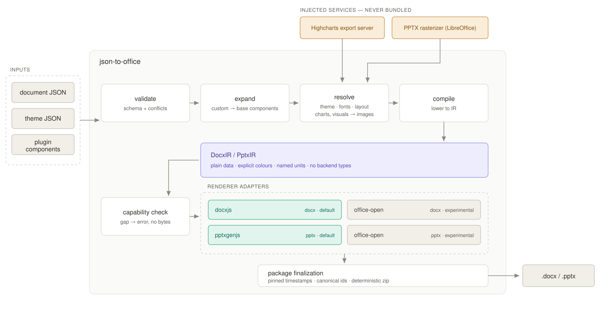
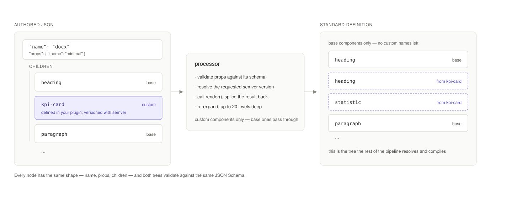

# Architecture

json-to-office is a pipeline: a JSON tree goes in, a validated and expanded tree of base components comes out, that tree is compiled to a renderer-neutral intermediate representation, and a renderer backend turns the IR into a real Office file. This page explains each stage and how the packages fit together.



## The JSON tree model

A document is a tree of **components**, in two flavours: **base components** — the built-in vocabulary of the format (heading, paragraph, table for DOCX; slide, text, chart for PPTX) — and **custom components** that you define in your own project via the plugin system.

Every node has the same shape: a `name`, a `props` object, and optionally `children`:

<!-- jto-validate: skip -- illustrates a custom plugin component (kpi-card) that is not in the base registry -->

```json
{
  "name": "docx",
  "props": { "theme": "minimal" },
  "children": [
    { "name": "heading", "props": { "text": "Q1 Report", "level": 1 } },
    {
      "name": "kpi-card",
      "props": { "label": "Revenue", "value": 4.2, "unit": "M$" }
    }
  ]
}
```



Here `heading` is a base component and `kpi-card` is a custom one. To the JSON author (human or LLM), there is no difference — both are validated against a schema, and the enriched schema (standard plus custom components) is exportable as JSON Schema for IDE autocomplete and runtime validation. See [Validation](/guide/validation) and [JSON schemas](/reference/json-schemas).

## Processor, compiler, renderer

Generation happens in three stages:

1. **The processor** walks the tree. When it encounters a custom component, it validates the props against that component's schema, resolves the requested semver version, calls the component's `render()` function, and splices the result back into the tree. If `render()` returns other custom components, the processor re-expands them recursively, up to **20 levels deep**. The output is a flat tree of base components only.
2. **The compiler** turns that flat tree into an **intermediate representation** — `DocxIR` or `PptxIR` — which is plain, serialisable data describing a finished document in Office terms and nothing else. By this point theme colours are explicit values, fonts are resolved and substituted, the inline text mini-language (`**bold**`, `[text](url)`, `{PAGE}`) is parsed into nodes, PPTX grid cells are explicit coordinates, and authoring-only components (`statistic`, `visual`, `highcharts`) have become the paragraphs and images they stand for. Every unit is named in the property itself: `widthEmu`, `sizeHalfPoints`, `spacingTwips`.
3. **The renderer adapter** translates the IR into one backend's vocabulary and asks it for bytes. [docx.js](https://github.com/dolanmiu/docx) is the default for DOCX and [pptxgenjs](https://github.com/gitbrent/PptxGenJS) for PPTX; both formats also ship an experimental `office-open` adapter.

This split is what makes the whole system predictable and testable: all dynamic logic lives in the expansion stage, every layout decision is resolved by the time the IR exists, and an adapter is a pure translation with no cascade or default left to apply. The IR is also testable on its own — you can snapshot a compiled document without loading a renderer at all.

There is deliberately no single shared IR across the two formats. A Word document is a flowing stream of blocks inside sections; a PowerPoint deck is absolutely-positioned shapes on fixed-size slides. What the formats share is the _contract_ — how a backend is selected, how it declares capabilities, how unsupported features are reported — and that lives in `@json-to-office/shared`.

### Choosing a backend

Each adapter declares the set of features it can express. Before rendering, the features the IR actually needs are compared against that set, and any gap fails the generation with the feature name and its path in the document — so an unsupported feature is an error, never a file with content quietly missing.

Pick a backend with the root `renderer` field, which also selects the matching branch of the JSON Schema:

```json
{ "name": "docx", "renderer": "office-open", "children": [] }
```

Generation options and the CLI's `--renderer` flag override the document field for a single run. Defaults are `docxjs` and `pptxgenjs`; `office-open` is experimental and opt-in. See the [API reference](/reference/api) and [CLI reference](/reference/cli#choosing-a-backend).

## Custom components and versioning

Custom components are defined with `createComponent` + `createVersion`. Each version carries a [TypeBox](https://github.com/sinclairzx81/typebox) props schema (chosen over Zod for its first-class JSON Schema support) and an async `render()` function returning an array of standard — or further custom — components:

```ts
import {
  createComponent,
  createVersion,
  createDocumentGenerator,
} from '@json-to-office/core-docx';
import { Type } from '@sinclair/typebox';

const kpiCard = createComponent({
  name: 'kpi-card',
  versions: {
    '1.0.0': createVersion({
      propsSchema: Type.Object({
        label: Type.String(),
        value: Type.Number(),
        unit: Type.Optional(Type.String()),
      }),
      render: async ({ props }) => [
        { name: 'heading', props: { text: props.label, level: 3 } },
        {
          name: 'statistic',
          props: {
            number: String(props.value),
            description: props.label,
            unit: props.unit,
          },
        },
      ],
    }),
  },
});

const generator = createDocumentGenerator({}).addComponent(kpiCard);
// then call generator.generateBuffer(...) / generate(...) directly — no build step
```

A component can hold **multiple semver-keyed versions** with different props and rendering logic. The document JSON specifies which version it wants; if omitted, the latest is resolved automatically. This lets a template evolve without breaking documents already stored in databases — old JSON keeps rendering with the version it was written against.

## Package graph

The monorepo is layered strictly bottom-up: format-agnostic shared code, then per-format schemas, then per-format engines, then the public APIs, then the tooling.

```
shared
  ├── shared-docx ──► core-docx ──► json-to-docx ─┐
  └── shared-pptx ──► core-pptx ──► json-to-pptx ─┤
                                                  ├──► jto (CLI + playground)
                                                  └──► jto-cli (lean CLI)
```

All nine packages are published to npm under the `@json-to-office` scope (currently 0.20.0; `shared` is 0.16.0):

| Package                        | Role                                                                           |
| ------------------------------ | ------------------------------------------------------------------------------ |
| `@json-to-office/shared`       | Format-agnostic shared types, schemas, validation, and the font system         |
| `@json-to-office/shared-docx`  | DOCX component schemas, component registry, validation                         |
| `@json-to-office/shared-pptx`  | PPTX component schemas, component registry, validation                         |
| `@json-to-office/core-docx`    | Core DOCX generation engine (processor, `DocxIR` compiler, renderer adapters)  |
| `@json-to-office/core-pptx`    | Core PPTX generation engine (processor, `PptxIR` compiler, renderer adapters)  |
| `@json-to-office/json-to-docx` | Public DOCX API — what you `npm install` to generate Word files                |
| `@json-to-office/json-to-pptx` | Public PPTX API — what you `npm install` to generate PowerPoint files          |
| `@json-to-office/jto`          | Full CLI, dev server, and visual playground                                    |
| `@json-to-office/jto-cli`      | Lean CLI for CI/scripted pipelines — same commands, no playground dependencies |

As an application developer you normally touch only `json-to-docx` / `json-to-pptx` (and a CLI). The shared packages matter when you consume the schemas directly — for example to validate LLM output before rendering. See the [API reference](/reference/api).

## Service injection: charts and rasterization

Two features need heavyweight external machinery that deliberately **never ships inside the published packages**:

- The **highcharts** component (both formats) renders charts server-side via a Highcharts Export Server, which requires Chromium.
- The DOCX **visual** component embeds a PPTX-composed graphic as a PNG, which requires a PPTX rasterizer (LibreOffice + poppler).

Instead of bundling those binaries, the libraries depend only on an interface. You inject a `services` configuration at generation time:

```ts
await docx(documentJson, 'report.docx', {
  services: {
    highcharts: { serverUrl: 'https://charts.example.com' },
    pptx: { serverUrl: 'https://rasterizer.example.com' },
  },
});
```

Each service accepts either an HTTP `serverUrl` (with optional static or async-resolved `headers`) or, for the PPTX rasterizer, an in-process `render` callback — ideal for tests and single-process hosts where you control the binaries yourself. Documents that use neither component need no services at all: the core libraries stay pure JavaScript with zero native dependencies.

::: info Running the services
The repository ships a ready-made combined render server (Highcharts Export Server + PPTX rasterizer behind one HTTP endpoint with a `/health` check) as a Docker service. See [Render server](/guide/render-server) for deployment, and [Charts](/guide/charts) for when to choose native charts vs. Highcharts.
:::

## Where to go next

- [Core concepts](/guide/core-concepts) — the authoring model built on top of this pipeline.
- [Validation](/guide/validation) — how schemas are generated and enforced.
- [Contributing](/guide/contributing) — working inside the monorepo (pnpm workspace + Turborepo).
