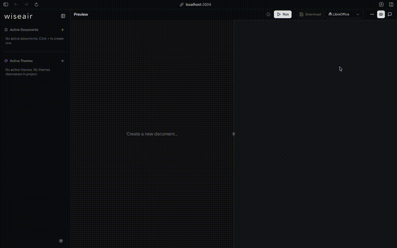
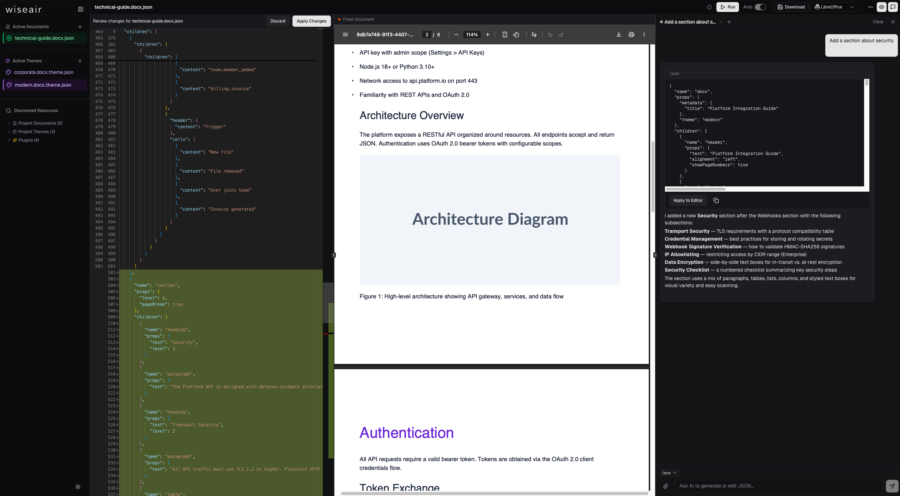

# Playground

The playground is a visual, browser-based environment for authoring json-to-office documents: a schema-aware JSON editor on the left, a live preview on the right, and one-click export to a real `.docx` or `.pptx`. You can use the hosted playgrounds immediately, or run the same app locally with the `jto` CLI.



## Hosted playgrounds

| Format | URL                                                                |
| ------ | ------------------------------------------------------------------ |
| DOCX   | [https://docx.json-to-office.com](https://docx.json-to-office.com) |
| PPTX   | [https://pptx.json-to-office.com](https://pptx.json-to-office.com) |

Both are deployments of the exact same dev server you get with `jto docx dev` / `jto pptx dev` — nothing playground-specific is closed source. The hosted instances ship with the AI assistant disabled; running locally gives you the full feature set.

## What it offers

- **Monaco JSON editor with schema autocomplete.** The editor is Monaco (the VS Code editor) wired to the generated JSON Schemas, so you get autocomplete for component names and props, inline validation errors, and hover documentation as you type. [JSON blocks](/reference/blocks#editor-assistance) complete too: the names your document defines at `ref`, their slots with descriptions and constraints, and whole invocations of any block — yours or a reference block from the shipped templates, whose definition is inserted along with it. See [Validation](/guide/validation) for how the same schemas are used outside the playground.
- **Document outline.** The sidebar shows a semantic table of contents for the active document — numbered slides labeled by their titles (PPTX), the heading hierarchy (DOCX), or top-level keys (themes). Clicking a node jumps the editor to its JSON; moving the cursor highlights the node you're in. Nodes with validation errors get a red dot, and slides or whole heading sections can be reordered by dragging them in the outline.
- **Live preview.** The preview re-renders as the JSON changes, so you iterate on layout and content without a download-open-check loop.
- **Design quality analysis.** A schema-valid document can still overflow its boxes or break its outline. The playground analyses the document as you type and reports findings — with evidence, the authored path, and often a one-click fix — beside the preview. See [Design quality in the playground](#design-quality) below.
- **Template gallery.** Built-in starting templates for each format, so you never begin from an empty `{}`. Browse them in the document sidebar and use them as a base for your own documents.
- **Theme switching.** Swap the document's theme and watch colors, fonts, and component defaults change instantly. See [Themes & styling](/guide/themes).
- **Compare (DOCX only).** The Compare button diffs two document JSONs into a redline `.docx` with native Word tracked changes — the same engine as `jto docx diff` and `POST /api/docx/diff`. See [the CLI guide](/guide/cli) for the command-line equivalent.
- **Download with font-mode prompt.** When you export a document that references fonts outside the safe list, a dialog asks how to handle them: **keep custom fonts** (references ship as-is; recipients without the font get a fallback) or **convert to safe fonts** (non-safe families are rewritten to Calibri / Georgia / Consolas so every recipient sees the same glyphs). This mirrors the library's `fonts.mode` option — see [Fonts](/guide/fonts).
- **Visual theme editor.** A theme file opens as a form — colour pickers with contrast checks, a font combobox, page geometry, every named style — beside a live sample that floats over the preview and a **Run sample** button that renders a real document in the theme. See [Visual theme editor](#visual-theme-editor).
- **Custom plugins, in the browser.** Write a custom component in TypeScript next to your documents. It is type-checked against the real plugin API, compiled and run in a Web Worker inside a sandboxed, opaque-origin frame, and expanded into standard components before anything reaches the server. See [Custom plugins in the browser](#custom-plugins-in-the-browser).



## Design quality

Structural [validation](/guide/validation) answers "will this render?". [Design
quality](/guide/design-quality) answers "will it read well?" — text estimated to
overflow its box, a heading that skips a level, a table wider than its section.
The playground runs that analysis continuously, so findings track the editor
rather than waiting for a build.

### The status row

The strip above the preview carries the verdict: a severity breakdown
(`2 errors · 5 warnings`), the profile the analysis ran under, and — when a gate
refused the build — a `blocked` badge. A clean document says `No findings`
rather than showing nothing, so silence never has to be interpreted.

Click it to open the findings drawer. The drawer floats over the preview
instead of pushing it down, because the analysis re-runs on every pause in
typing and a panel in the column would move the page you are reading each time
a finding appeared or cleared. `Escape` or a click on the page dismisses it.

### Findings

Each finding leads with what is wrong in plain language, then:

- **evidence** — `Expected 487.3 pt · found 600 pt`, the measurement the rule
  actually made;
- **a suggestion**, paired with an **Apply fix** button when the finding carries
  RFC 6902 operations that repair it;
- **the authored path** — click it to reveal that node in the editor;
- **certainty and code**, as reference. Certainty matters: a `deterministic`
  finding measured the resolved document, while an `estimated` one applied a
  heuristic and can be wrong.

Applying a fix rewrites the document JSON and re-analyses it, so the panel
reflects the repair immediately. Fixes are proposals — review them, especially
when shrinking type would preserve fit at the cost of design intent.

### Quality settings

The **Quality settings** button opens the same drawer with the run controls:

- **Profile** — one of the shipped profiles for the current format, or the
  format's default. Only profiles that fit the open format are offered.
- **Gate** — the severity that makes generation fail. `Never blocks` is the
  default: findings are reported and the run always finishes. With a gate set,
  a failing build opens the drawer with the diagnostics that refused it.
- **Show** — a display filter for the panel only. It defaults to
  warning-and-above, because the shipped templates produce a large number of
  advisory infos; anything hidden is still counted and one click away.

### Rule policy

The **Rule policy** editor covers the rest of the
[policy contract](/guide/design-quality#policies-and-gates): per-rule severity,
enable/disable and parameters, suppressions, the diagnostic budget, and
`onRuleError`. It is schema-backed, so completion offers the real rule ids for
the open format and explains each parameter.

```json
{
  "rules": {
    "pptx/minimum-font-size": { "parameters": { "minimumFontPt": 12 } },
    "pptx/slide-density": { "severity": "error" }
  },
  "suppressions": [
    {
      "ruleId": "pptx/text-fit",
      "path": "/children/4",
      "reason": "Deliberate full-bleed quote slide."
    }
  ]
}
```

Two rules of the road:

- `gate` and `profile` are **not** accepted here — they have their own controls
  above, and two writable sources for one setting means one of them lies.
- A policy that does not parse is not sent at all, so a half-typed brace leaves
  the previous run standing instead of failing every keystroke.

Every suppression requires a `reason`. That is deliberate: a muted finding
nobody has to justify is how a rule quietly stops being enforced.

## Visual theme editor

A theme tab opens in **Visual** mode; the **Visual · JSON** switch in the app header — present only while a theme is open — moves to the Monaco source view (with schema completion, as before), and the choice is remembered. The switch lives in the header rather than on a strip of its own so the whole tab is form. Both views edit the same file: an edit in the form rewrites the JSON, an edit in the JSON is what the form shows next time you switch. Keys the form has no field for — `componentDefaults`, `fontRegistry`, `noProofWords` — are never touched; they are listed under **Advanced** with a shortcut to edit them as JSON.

The form is generated from the [theme schema](/reference/theme-schema) of the running format, so it changes when the schema does:

- **Colours** — one row per token, grouped (core, text, background, border, chart), each with a picker, a hex field and a clear button for optional tokens. The swatch opens a saturation square, a hue rail, a hex field, the screen eyedropper where the browser has one, and the theme's own colours as chips: click one and the value becomes a reference to that token, which then follows it. Text-on-background and primary-on-background show their contrast ratio, so a palette that will not read on the page says so before you render it.
- **Typography** — a searchable combobox of safe and Google families per role, with **Browse all fonts…** into the full picker, and — for DOCX — the base size per role; for PPTX the `defaults` size and colour. Number fields carry steppers that hold to repeat and start from the field's floor when the key is unset.
- **Page** (DOCX) — page size and margins, edited in inches, centimetres or points and stored in twips.
- **Styles** — every named style slot (`normal`, `title`, `heading1`–`heading6`, TOC levels for DOCX; `title` to `caption` for PPTX) plus any custom style a DOCX theme defines. Each expands to its fields: font role or face, size, weight, colour (a token or a hex, from the same picker), alignment, spacing, line spacing, and a **More** disclosure for the rest. A boolean is three-state — **Unset · Off · On** — because a style that says nothing about `bold` inherits, while one that says `false` overrides.

**Theme sample**, in the status row above the preview, opens a drawer over the page with an in-browser approximation of the theme: title, headings, body text, a table and the chart palette, in the theme's own fonts and colours. It repaints on every edit, and it floats for the same reason the quality drawers do — a card in the form would shove the field you are typing in down the screen each time. It is drawn by the browser, not by the renderer, so it is a guide to the palette and the type, not to the page.

**Run sample**, in that drawer, renders a document that exercises the theme — every style slot, the defined colour tokens as swatches, a table, and on PPTX a native chart drawn from the palette — through the same generate + preview pipeline as Run, under the name `Sample · <theme>`. What you see is what the theme produces, not an approximation. Editing the theme afterwards marks the preview stale, as editing a document does, and while the sample is what is on screen, **Run** on the theme tab refreshes the sample rather than the last document.

The **Identity** section says which open documents use the theme (renaming it breaks their reference until they are updated) and warns when another open theme file declares the same name. A theme whose JSON does not parse, or that has an AI change waiting to be reviewed, opens in the JSON view until that is resolved.

## Custom plugins in the browser

[Custom components](/guide/architecture#custom-components) normally live in `*.component.ts` files that the CLI and the dev server discover on disk. The playground can also host them in the browser: **Plugins ▸ +** creates a `*.component.ts` file next to your documents, seeded with a starter component for the running format (or with the source of a plugin discovered on disk).

The file opens in a TypeScript editor wired to the real declarations of `@sinclair/typebox` and the json-to-office plugin API, so `props` inside `render()` is typed by your schema and a wrong import is a red squiggle. Every pause in typing recompiles the file; the strip above the editor shows the component's name and version, whether it compiled, and the errors if it did not. Once it is **Ready** the component is part of the document schema — completions offer it by name, its props validate — and any document that names it renders through it.

### Where it runs

Plugin code never reaches the server. It is compiled in the page and executed in a Web Worker per plugin, and that worker lives inside a sandboxed `<iframe>` with an opaque origin rather than in the page itself:

- The frame is `sandbox="allow-scripts"` only, so it is a different origin from the playground: it cannot read the page, its cookies, its IndexedDB (where your documents live) or its `localStorage`, and a plugin that escapes the worker is still inside that frame. Its Content Security Policy allows the worker's own script and nothing else — no stylesheets, images, frames or navigation.
- Inside the worker, storage and cross-context messaging (`indexedDB`, `caches`, `importScripts`, nested workers, `BroadcastChannel`, the file-system pickers) are removed before the code runs.
- **Network** is off by default: the frame's policy blocks every connection, and `fetch`, `XMLHttpRequest`, `WebSocket`, `EventSource` and `navigator.sendBeacon` throw with a message pointing at the switch. Turning **Network** on in the editor strip lifts both for that plugin, which then runs with a fresh sandbox and may call any URL from your browser — reserve it for code you trust. The setting is per plugin and is remembered.
- Loading is limited to 8 seconds and a render to 20 seconds; a plugin that overruns has its whole frame torn down and is reported, and the next build starts it afresh. An idle sandbox is discarded after 30 seconds.
- `require` resolves only `@sinclair/typebox`, `@json-to-office/shared`, `@json-to-office/shared-docx`, `@json-to-office/shared-pptx` and the plugin API paths (`@json-to-office/core-docx`, `@json-to-office/core-pptx`, `@json-to-office/json-to-docx`, `@json-to-office/json-to-pptx`, and their `/plugin` subpaths). Anything else fails with a message naming the list.
- A render may return at most 5 MB of components, and an expansion at most 10,000 nodes; the document budget is what stops a plugin that expands without end.

The sandbox keeps a plugin away from your data; it does not make the code trustworthy. A plugin can still return components that point at remote images or fonts, which the server then fetches when it renders — the warnings bar lists every remote URL an expansion introduced.

Before a document is sent anywhere — Run, the quality analysis, Compare, **Copy standard components**, a download — the page expands every browser-plugin component into the standard components its `render()` returned, the same walk the cores perform for disk plugins: children first, the render output expanded again in case it names another custom component, twenty levels deep at most. The server receives standard JSON, plus whatever disk plugins it already knows. Warnings raised with `addWarning` appear in the warnings bar, labelled `name@version`.

### What it does not do

- A plugin whose name collides with a built-in component, a disk plugin, or another browser plugin is reported and left out until renamed. Between two browser plugins the older file keeps the name; the newer one becomes ready the moment the other is renamed or deleted. A plugin copied from disk is renamed `<name>-custom` so the two can coexist.
- The **Enabled** switch (in the strip and in the sidebar) takes a plugin out of the schema and the expansion without deleting it. A document that still names a disabled plugin — or one that failed to compile — does not build; the error says which file to open.
- Quality findings that land inside a plugin's output are pointed back at the plugin node in your document and carry no automatic fix; the fix belongs in the plugin.
- The compiled code and metadata persist in the browser, so a reload can build documents that use the plugin before its tab is opened again. The source lives with your documents.
- To use the same component from the CLI or your own code, **Download** the file: it is written against the public import paths, so it compiles unchanged once the packages are installed. See the [Plugin API](/reference/api#plugin-api).

## High-fidelity PDF preview (LibreOffice)

The default preview is fast but approximate. If headless LibreOffice is installed on the machine running the server, the playground can additionally render your document to PDF through LibreOffice for a high-fidelity preview.

This matters most for PPTX: there is no browser-based renderer for PowerPoint files, so a LibreOffice PDF is the only way to get pixel-accurate output before opening the file in PowerPoint itself.

Two details worth knowing:

- **Staged fonts.** Before invoking LibreOffice, the server registers your document's resolved fonts with the OS — Google Fonts fetched from the built-in catalog (and disk-cached), plus any fonts you registered via `--font` or `--fonts-dir`. This makes the PDF preview show the actual typefaces. It never changes the exported document's bytes; generated files never embed fonts.
- **Graceful absence.** LibreOffice is optional. Without it, the preview endpoints return a 503 and the playground falls back to the standard preview. Point the server at a specific binary with the `LIBREOFFICE_PATH` environment variable if it is not on your `PATH`.

## AI assistant

The playground includes a built-in AI chat assistant powered by Claude. It can generate documents from a brief, edit the current document, or rework a selection, with format-specific system prompts for DOCX and PPTX. The PPTX prompts are written around [JSON blocks](/reference/blocks#pptx): standard slides invoke a block, the reference blocks the server discovers ride along with their definitions, and code plugins are reserved for programmable behavior. For a deck, the **Scope** switch narrows an edit to the slides (block definitions untouched) or to the block definitions in `props.blocks` (slides untouched); the assistant then returns only that part, merged back for review.

- **Models:** `opus` (default), `sonnet`, or `haiku`, selectable from the chat panel.
- **Authentication:** the server uses `ai-sdk-provider-claude-code`, which reuses your local [Claude Code](https://www.anthropic.com/claude-code) authentication. There is no API key to configure — if Claude Code works on your machine, the assistant works too.
- **Attachments:** images are passed to the model natively; PDF, text, markdown, CSV, and HTML attachments have their text extracted and included in context.
- **Disabling it:** set `AI_ENABLED=false` on the server to unmount the `/api/ai` routes entirely (the hosted playgrounds run this way, with `VITE_AI_ENABLED=false` also hiding the UI at build time).

::: info
The AI assistant and LibreOffice previews are playground-only extras. The core generation libraries have zero dependency on either — see [Architecture](/guide/architecture). For using json-to-office _from_ an LLM in your own pipeline, see [LLM integration](/guide/llms).
:::

## Running locally

The playground ships in the full CLI package, `@json-to-office/jto`:

```bash
pnpm add --global @json-to-office/jto

jto docx dev   # DOCX playground on http://localhost:3003
jto pptx dev   # PPTX playground on http://localhost:3004
```

On start, the CLI prints the local URL, the generation API URL (`http://localhost:<port>/api/<format>/generate`), and the health endpoint (`/health`).

| Flag                  | Default                       | Description                                                                  |
| --------------------- | ----------------------------- | ---------------------------------------------------------------------------- |
| `-p, --port <port>`   | `3003` (docx) / `3004` (pptx) | Server port. `-p` > config-file `server.port` > `PORT` > the format default. |
| `-H, --host <host>`   | `localhost`                   | Bind host.                                                                   |
| `-o, --open`          | off                           | Open the browser automatically.                                              |
| `-c, --config <path>` | —                             | Path to a config file.                                                       |

::: tip
The lean `@json-to-office/jto-cli` package deliberately excludes the playground (no React, Monaco, Vite, or AI dependencies) to stay small for CI and serverless use. Running `jto-cli docx dev` prints a pointer to install `@json-to-office/jto` instead. See [the CLI guide](/guide/cli).
:::

The dev server also exposes an HTTP API (`/generate`, `/validate`, `/diff`, LibreOffice previews, discovery, fonts, and more) that you can call directly — the full route list is in the [CLI reference](/reference/cli). For deploying the playground and its rendering backends, see [Render server & deployment](/guide/render-server).
